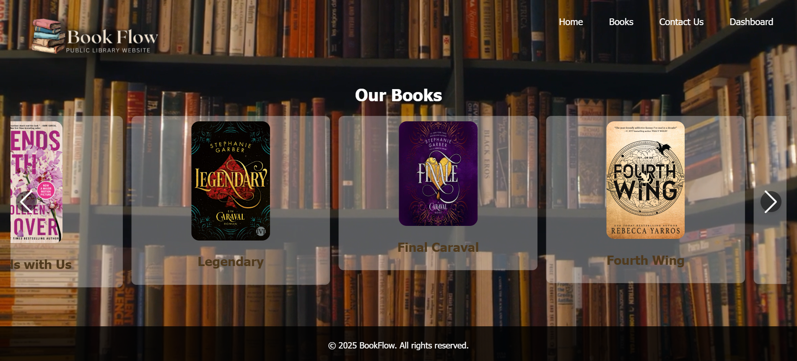
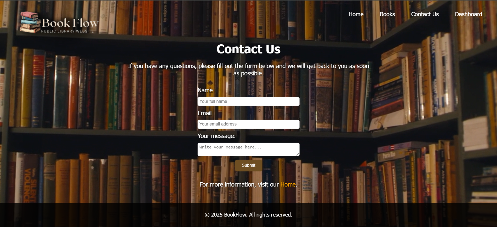

# 📚 Library Web System

A simple web-based library management interface developed using HTML, CSS, JavaScript, and PHP. The project provides an interactive website for browsing books, viewing book information, contacting the library, and accessing an administrative dashboard.

---

## 📖 Project Overview

The Library Web System is designed to simulate a modern public library website. Users can browse available books, view book information, submit contact requests, and navigate through an attractive interface with multimedia support.

The project combines front-end technologies with PHP pages to demonstrate basic dynamic web development concepts.

---

## ✨ Features

- 🏠 Home page with welcome section
- 📚 Interactive books gallery
- 📖 Book information display
- 📩 Contact Us form
- 🎵 Background audio
- 🎥 Background video
- 📱 Responsive user interface
- 🎨 Modern design using CSS
- ⚙️ PHP dashboard support

---

## 🛠️ Technologies Used

- HTML5
- CSS3
- JavaScript
- PHP

---

## 📂 Project Structure

```
Library-Web-System/
│
├── images/
│   ├── home.png
│   ├── books.png
│   └── contact-us.png
│
├── project/
│   ├── books/
│   ├── css/
│   └── js/
│
├── Home.html
├── Books.html
├── Contact Us.html
├── Dashboard.php
├── getBookDetails.php
├── README.md
└── .gitignore
```

---

## 📷 Screenshots

### Home Page


---

### Books Page



---

### Contact Us Page



---

## 🚀 How to Run

1. Download or clone the repository.

```bash
git clone https://github.com/Shooqaladwani/Library-Web-System.git
```

2. Open the project folder.

3. Open **Home.html** using Live Server or any modern web browser.

4. To use the PHP pages (`Dashboard.php` and `getBookDetails.php`), run the project using a local PHP server such as **XAMPP**.

---

## 📌 Notes

- HTML, CSS, and JavaScript pages work directly in the browser.
- PHP functionality requires a local PHP server (e.g., XAMPP).
- Images, audio, and video files are located inside the `project/books` folder.

